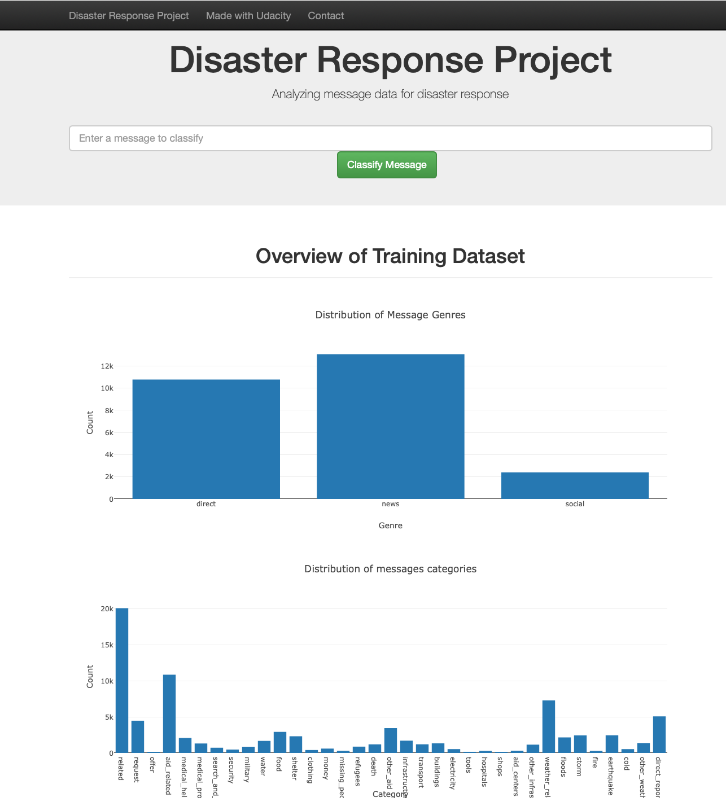

# DSND-disaster_recovery-project

## Summary

In this Udacity's project in collaboration with Figure Eight, there is a data set containing real messages that were sent during disaster events. I have created a machine learning pipeline to categorize these events so that messages can be sent to an appropriate disaster relief agency.

The project will include a web app where an emergency worker can input a new message and get classification results in several categories. The web app will also display visualizations of the data. 

## Structure of the project

- app
  - template
    - master.html -- main page of web app
    - go.html -- classification result page of web app
  - run.py  -- Flask file that runs app

- data
  - disaster_categories.csv -- data to process 
  - disaster_messages.csv  -- data to process
  - process_data.py -- ETL file
  - DisasterResponse.db -- database to save clean data to as per script below

- models
  - train_classifier.py -- ML file
  - classifier.pkl  -- saved model 

- README.md

## Script

You will need to run in a terminal the following command at the project root directory:

-  ETL to clean and save in a database:

     python process_data.py disaster_messages.csv disaster_categories.csv DisasterResponse.db

-  ML pipeline to categorize the messages received:

     python train_classifier.py ../data/DisasterResponse.db classifier.pkl

- Once the previous step is done, change root to the app folder to run the web app:

     python run.py

-  Check in a browser the result: http://0.0.0.0:3001

## Screenshot of the web app:

